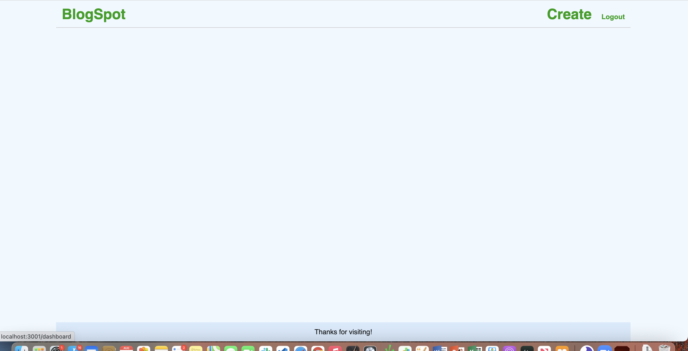
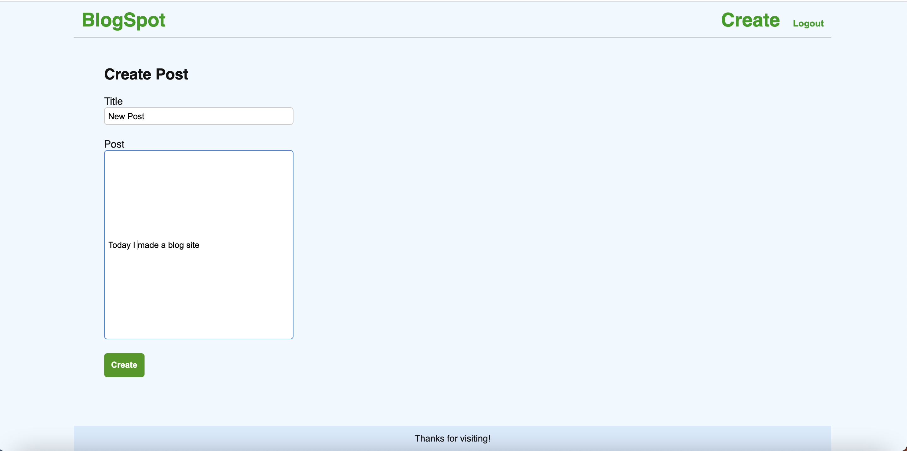
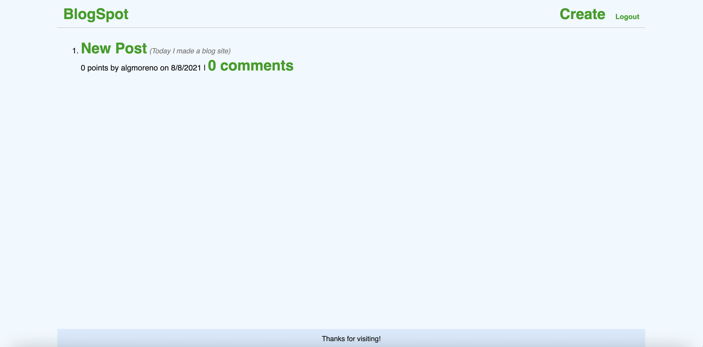

# blogspot

## Installation
The necessary modules to run this app are:
  - sequelize
  - mysql2
  - express
  - express-handlebars
  - dotenv
  - connect-session-sequelize
  - bcrypt

## Run 
node server

## Description 
This app is a blog website. At the start, the user will be taken to the homepage. User will need to click login button before using any of the site's functionality. User will either create a new account or log in to an existing account. Once given access, the user can now create a post by clicking "Create" button where they will be prompted to enter title of post and post itself. 

The user can then choose Edit Post, in order to change the post or leave a comment. If not, the user can go back to the homepage and see all the posts that have been created.

## Screenshots 
 "Homepage")
 "Create post")
 "Dashboard with new post")
 "Edit page")